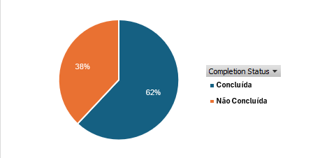
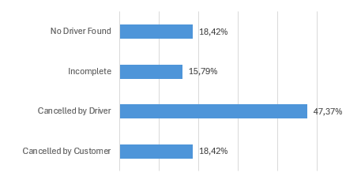

# Análise de Reservas e Corridas Não Concluídas — Uber NCR


## Sumário

- [Problema de negócio](#problema-de-negócio)
- [Contexto](#contexto)
- [Objetivo](#objetivo)
- [Base de dados](#base-de-dados)
- [Premissas da análise](#premissas-da-análise)
- [Ferramentas utilizadas](#ferramentas-utilizadas)
- [Estratégia da solução](#estratégia-da-solução)
- [Priorização das análises](#priorização-das-análises)
- [Principais insights](#principais-insights)
- [Recomendações](#recomendações)
- [Resultado final](#resultado-final)
- [Limitações](#limitações)
- [Próximos passos](#próximos-passos)

---

## Problema de negócio

A plataforma apresenta **38% de corridas não concluídas**, o equivalente a **57 mil reservas em uma base de 150 mil registros**. Esse resultado reduz a eficiência operacional, prejudica a experiência do cliente e representa perda de oportunidades de viagem.

O problema central do projeto foi transformado na seguinte pergunta:

> **Quais localidades de embarque concentram as maiores taxas de não conclusão e quais status, motivos, horários, tipos de veículo e tempos de chegada ajudam a explicar esse resultado?**

A análise também buscou responder quais ações poderiam aumentar a taxa de conclusão, melhorar a disponibilidade de motoristas e reduzir cancelamentos.

## Contexto

A operação analisada corresponde a reservas de mobilidade urbana realizadas na região **NCR (National Capital Region), na Índia**. Cada reserva pode terminar como concluída ou como um dos seguintes casos de não conclusão:

- cancelamento pelo motorista;
- cancelamento pelo cliente;
- motorista não encontrado;
- corrida incompleta.

Como diferentes fatores podem ocorrer simultaneamente na operação, a análise começou pelo resultado geral, identificou as localidades prioritárias e, em seguida, investigou os componentes com maior relevância e possibilidade de ação.

## Objetivo

Realizar uma análise descritiva das reservas para:

1. medir a taxa geral de não conclusão;
2. identificar as localidades com resultado superior à média geral;
3. decompor a não conclusão por status;
4. investigar motivos, períodos, veículos e tipo de dia;
5. avaliar a relação entre tempo de chegada e cancelamento do cliente;
6. transformar os achados em recomendações operacionais.

## Base de dados

A base contém **150.000 reservas** e campos relacionados à operação, ao cliente e à viagem.

| Grupo | Exemplos de campos |
|---|---|
| Identificação | `Booking ID`, `Ride Key`, `Customer ID` |
| Tempo | `Date`, `Time`, hora, período do dia e tipo de dia |
| Operação | `Booking Status`, `Vehicle Type`, `Pickup Location`, `Drop Location` |
| Experiência | `Avg VTAT`, `Avg CTAT`, `Driver Ratings`, `Customer Rating` |
| Viagem | `Ride Distance`, `Booking Value`, `Payment Method` |
| Cancelamentos | Motivos do cliente e do motorista |
| Indicadores auxiliares | Flags de não conclusão, cancelamento e motorista não encontrado |

### Indicadores criados

Foram utilizadas flags numéricas com valor `1` para ocorrência e `0` para os demais registros:

- `Non-Completion Flag`;
- `Driver Cancellation Flag`;
- `Customer Cancellation Flag`;
- `No Driver Found Flag`;
- `Incomplete Rides Flag`.

Essas colunas permitem calcular taxas utilizando todas as reservas do grupo analisado como denominador, evitando percentuais distorcidos por filtros de status.

## Premissas da análise

1. Cada `Ride Key` representa uma reserva na base tratada.
2. Uma corrida foi classificada como não concluída sempre que o `Booking Status` foi diferente de `Completed`.
3. A taxa de cada evento foi calculada dividindo sua quantidade pelo total de reservas do mesmo recorte.
4. A média geral de **38%** foi utilizada como referência para selecionar localidades prioritárias.
5. O Top 10 foi definido pela **taxa de não conclusão**, e não apenas pela quantidade absoluta de ocorrências.
6. As análises de risco por período, veículo ou tipo de dia foram calculadas sem filtrar previamente o `Booking Status`.
7. Combinações com menos de aproximadamente 30 ocorrências devem ser interpretadas com cautela.
8. Resultados descritivos indicam associação, mas não comprovam relação causal.
9. Campos nulos foram excluídos apenas das métricas que dependiam diretamente deles, sem remover a reserva das demais análises.

## Ferramentas utilizadas

- **Excel:** exploração inicial e validação dos resultados;
- **Power Query:** limpeza, tipagem e criação de colunas auxiliares;
- **Tabelas dinâmicas:** testes de hipóteses e conferência dos denominadores;
- **Power BI:** modelagem, medidas DAX, visualizações e dashboard;
- **DAX:** cálculo de totais, taxas, rankings e indicadores dinâmicos.

## Estratégia da solução

### Passo 1: transformar o contexto em uma pergunta analítica

A pergunta ampla — “Como reduzir as corridas não concluídas?” — foi convertida em uma pergunta investigável:

> Quais localidades estão acima do padrão geral e quais componentes operacionais explicam o resultado de cada uma?

### Passo 2: validar e preparar os dados

Foram verificados tipos de dados, valores ausentes, chaves, categorias de status e consistência dos campos numéricos. Também foram criadas colunas para:

- hora da reserva;
- período do dia;
- dia útil ou fim de semana;
- faixas de `Avg VTAT`;
- flags numéricas para cálculo das taxas.

### Passo 3: medir o resultado geral

A base apresentou:

| Resultado | Reservas | Participação |
|---|---:|---:|
| Concluídas | 93.000 | 62% |
| Não concluídas | 57.000 | 38% |
| **Total** | **150.000** | **100%** |

O primeiro nível da análise confirmou que mais de uma em cada três reservas não foi concluída.



### Passo 4: decompor a não conclusão por status

| Status | Reservas | Taxa sobre todas as reservas | Participação nas não conclusões |
|---|---:|---:|---:|
| Cancelled by Driver | 27.000 | 18% | 47,37% |
| Cancelled by Customer | 10.500 | 7% | 18,42% |
| No Driver Found | 10.500 | 7% | 18,42% |
| Incomplete | 9.000 | 6% | 15,79% |
| **Total não concluído** | **57.000** | **38%** | **100%** |

O cancelamento pelo motorista foi o maior componente da não conclusão. Por isso, recebeu a maior prioridade investigativa.



### Passo 5: identificar as localidades prioritárias

As localidades foram comparadas pela taxa de não conclusão. Foram selecionadas as dez localidades acima da média geral com maior resultado.


| Localidade | Reservas | Não concluídas | Taxa de não conclusão |
|---|---:|---:|---:|
| Vinobapuri | 823 | 373 | 45,32% |
| Akshardham | 839 | 368 | 43,86% |
| Chhatarpur | 829 | 347 | 41,86% |
| Badshahpur | 868 | 362 | 41,71% |
| Pragati Maidan | 920 | 382 | 41,52% |
| Netaji Subhash Place | 830 | 343 | 41,33% |
| Vatika Chowk | 833 | 344 | 41,30% |
| Faridabad Sector 15 | 831 | 343 | 41,28% |
| Indirapuram | 854 | 351 | 41,10% |
| IFFCO Chowk | 830 | 339 | 40,84% |
| **Top 10** | **8.457** | **3.552** | **42,00%** |

O Top 10 apresentou taxa média de **42%**, quatro pontos percentuais acima da média geral.

### Passo 6: investigar os cancelamentos dos motoristas

Nas localidades prioritárias, foram registrados **1.692 cancelamentos pelo motorista**, correspondentes a **20,01% das reservas** do grupo.

Os motivos apresentaram distribuição próxima:

| Motivo | Participação |
|---|---:|
| Customer related issue | 25,35% |
| More than permitted people in there | 25,06% |
| The customer was coughing/sick | 24,94% |
| Personal & Car related issues | 24,65% |


Não houve um único motivo dominante. O resultado indica que o problema é distribuído entre diferentes situações, exigindo controles mais abrangentes.

Também foram comparadas as taxas entre períodos, veículos e tipos de dia:

- fim de semana: **21,14%**;
- dias úteis: **19,57%**;
- fora de pico: **20,87%**;
- pico da noite: **20,13%**;
- noite/madrugada: **19,87%**;
- pico da manhã: **17,60%**;
- Go Sedan e Premier Sedan: **21,35%**;
- eBike: **21,22%**.


As diferenças foram moderadas. Portanto, os maiores valores devem ser tratados como pontos de acompanhamento, e não como causas isoladas.

### Passo 7: analisar motorista não encontrado

No Top 10, a taxa de `No Driver Found` foi de **7,98%**, com **675 ocorrências**.

Principais destaques:

- Vinobapuri: **9,23%**;
- noite/madrugada: **8,46%**;
- Uber XL: **9,91%**, porém com apenas 22 ocorrências;
- Go Sedan: **8,48%**;
- Auto: **8,35%**.


O baixo volume do Uber XL reforça a necessidade de apresentar quantidade e percentual em conjunto.

### Passo 8: relacionar cancelamento do cliente e tempo de chegada

A taxa de cancelamento do cliente aumentou conforme o `Avg VTAT`:

| Faixa de Avg VTAT | Reservas com informação | Cancelamentos | Taxa |
|---|---:|---:|---:|
| Até 5 minutos | 1.710 | 1 | 0,06% |
| De 6 a 10 minutos | 3.440 | 218 | 6,34% |
| De 11 a 15 minutos | 2.426 | 218 | 8,99% |
| Acima de 15 minutos | 206 | 206 | 100,00% |
| **Total** | **7.782** | **643** | **8,26%** |


O comportamento sugere associação entre espera e desistência. Entretanto, o resultado de 100% acima de 15 minutos deve ser validado, pois pode refletir a forma como o campo foi preenchido ou disponibilizado na base.

Além disso, **44,10% dos motivos informados pelos clientes** estavam relacionados a:

- motorista não se deslocando até o embarque;
- motorista solicitando que o cliente cancelasse.

Esses motivos reforçam a importância de monitorar o início do deslocamento e a comunicação entre motorista e passageiro.

### Passo 9: construir o dashboard

O dashboard foi organizado para conduzir a leitura do geral ao específico:

1. visão geral das reservas;
2. localidades prioritárias;
3. cancelamentos pelos motoristas;
4. motorista não encontrado;
5. experiência do cliente;
6. recomendações operacionais.


## Priorização das análises

As análises foram priorizadas considerando quatro critérios:

1. **impacto no problema:** contribuição para os 38% de não conclusão;
2. **volume:** quantidade de reservas ou ocorrências sustentando a taxa;
3. **possibilidade de ação:** existência de uma decisão operacional associada;
4. **qualidade dos dados:** disponibilidade e consistência dos campos necessários.

| Prioridade | Análise | Justificativa | Possível ação |
|---:|---|---|---|
| 1 | Não conclusão por status | Identifica o maior componente do problema | Direcionar a investigação |
| 2 | Taxa por localidade | Localiza as áreas mais críticas | Priorizar operação regional |
| 3 | Cancelamento do motorista | Representa 47,37% das não conclusões | Monitoramento, políticas e incentivos |
| 4 | No Driver Found | Mede indisponibilidade de oferta | Reposicionar motoristas |
| 5 | Avg VTAT × cancelamento do cliente | Liga experiência de espera à desistência | Reduzir espera e melhorar comunicação |
| 6 | Motivo × horário, veículo e dia | Procura concentrações específicas | Ações segmentadas quando houver diferença relevante |

## Principais insights

### 1. O cancelamento pelo motorista é o principal componente

Os cancelamentos pelos motoristas representam **18% de todas as reservas** e aproximadamente **47% das corridas não concluídas**.

### 2. As localidades prioritárias têm desempenho consistentemente inferior

O Top 10 registrou **42% de não conclusão**, contra **38% na operação geral**. Vinobapuri apresentou o maior risco, enquanto Pragati Maidan teve o maior número absoluto de não conclusões entre as dez localidades.

### 3. Não existe um único motivo dominante entre os motoristas

Os quatro motivos ficaram próximos de 25%. Isso reduz a segurança de recomendar uma ação baseada em apenas uma categoria e aponta para um problema distribuído.

### 4. Finais de semana e alguns veículos merecem acompanhamento

A taxa de cancelamento do motorista foi maior nos finais de semana e em algumas categorias de veículo, mas as diferenças não foram suficientemente grandes para explicar sozinhas o resultado geral.

### 5. A indisponibilidade é mais intensa em recortes específicos

Vinobapuri e o período de noite/madrugada ficaram acima da média do Top 10 em `No Driver Found`, sugerindo oportunidade de ajuste de oferta.

### 6. O tempo de chegada está associado ao cancelamento do cliente

As taxas aumentaram nas faixas maiores de `Avg VTAT`. O resultado é coerente com os motivos relacionados ao motorista não se deslocar ou solicitar o cancelamento.

## Recomendações

### Prioridade 1: reduzir cancelamentos dos motoristas

- acompanhar taxa e volume por motorista, localidade e período;
- criar alertas para motoristas que aceitam a reserva e não iniciam o deslocamento;
- investigar solicitações para que o cliente cancele;
- revisar políticas e orientações para os diferentes motivos de cancelamento;
- testar incentivos nas combinações de localidade e horário com pior resultado.

### Prioridade 2: melhorar disponibilidade

- reposicionar veículos antes dos períodos de maior indisponibilidade;
- acompanhar Vinobapuri e outras localidades acima da média;
- avaliar incentivos temporários durante noite/madrugada e finais de semana;
- comparar demanda, oferta e tempo de aceite antes de expandir a intervenção.

### Prioridade 3: reduzir espera e desistência

- revisar a precisão do tempo estimado apresentado ao cliente;
- enviar atualizações durante o deslocamento do motorista;
- reatribuir a reserva quando não houver movimento em direção ao embarque;
- monitorar a taxa de cancelamento por faixa de `Avg VTAT`;
- validar os registros acima de 15 minutos antes de definir uma regra automática.

### Prioridade 4: acompanhar por metas

- taxa geral de conclusão;
- taxa de cancelamento pelo motorista;
- taxa de cancelamento pelo cliente;
- taxa de `No Driver Found`;
- `Avg VTAT` médio;
- percentual de reservas com `Avg VTAT` acima de 10 minutos;
- quantidade de não conclusões acima do esperado por localidade.

## Resultado final

A análise identificou que o problema de não conclusão não está concentrado em um único motivo ou apenas em uma localidade. O principal componente é o **cancelamento pelo motorista**, presente de forma relativamente padronizada entre localidades, motivos e categorias.

Ao mesmo tempo, foram identificados pontos de atuação mais específicos:

- Vinobapuri apresentou a maior taxa de não conclusão e a maior taxa de motorista não encontrado entre as localidades prioritárias;
- finais de semana apresentaram maior risco de cancelamento pelo motorista;
- noite/madrugada apresentou maior indisponibilidade de motoristas;
- o aumento do `Avg VTAT` esteve associado a taxas maiores de cancelamento do cliente;
- 44,10% dos motivos dos clientes envolveram falta de deslocamento ou solicitação de cancelamento pelo motorista.

O resultado apoia uma estratégia combinada: controles gerais para reduzir cancelamentos dos motoristas, acompanhados de intervenções direcionadas por localidade, horário e tempo de chegada.

## Limitações

- A análise é descritiva e não comprova causalidade.
- O período exato de cobertura da base deve ser documentado conforme a fonte original.
- Alguns campos de experiência possuem valores ausentes e, por isso, utilizam denominadores diferentes.
- A faixa de `Avg VTAT` acima de 15 minutos apresentou 100% de cancelamento do cliente e precisa de validação adicional.
- Resultados de categorias com baixo volume, como Uber XL em `No Driver Found`, não devem ser generalizados.
- O uso de localidades de embarque não implica que cada registro represente uma cidade independente.
- Não foram disponibilizados dados de oferta ativa de motoristas, trânsito, clima ou incentivos, que poderiam ampliar a explicação operacional.

## Próximos passos

1. Validar a regra de preenchimento de `Avg VTAT`, especialmente acima de 15 minutos.
2. Incorporar quantidade de motoristas disponíveis, tempo de aceite e deslocamento após o aceite.
3. Acompanhar as métricas ao longo do tempo para verificar tendência e sazonalidade.
4. Criar alertas para aumento de cancelamento ou indisponibilidade por localidade e horário.
5. Realizar testes controlados de reposicionamento e incentivos.
6. Medir o impacto das ações antes e depois da implementação.
7. Evoluir o dashboard para acompanhamento recorrente da operação.

---

## Estrutura sugerida do repositório

```text
projeto-uber-ncr/
├── README.md
├── data/
│   └── ncr_ride_bookings.csv
├── dashboard/
│   └── uber_ncr_dashboard.pbix
├── analysis/
│   └── analises_exploratorias.xlsx
└── assets/
    ├── 01_composicao_geral.png
    ├── 02_top10_localidades.png
    ├── 03_composicao_status_top10.png
    ├── 04_motivos_motorista.png
    ├── 05_taxas_motorista.png
    ├── 06_no_driver_found.png
    ├── 07_vtat_cancelamento_cliente.png
    └── 08_dashboard_localidades.png
```

## Autor

**Luís Felipe Santos Oliva**  
Estudante de Análise e Desenvolvimento de Sistemas, com foco em Análise de Dados e Business Intelligence.

