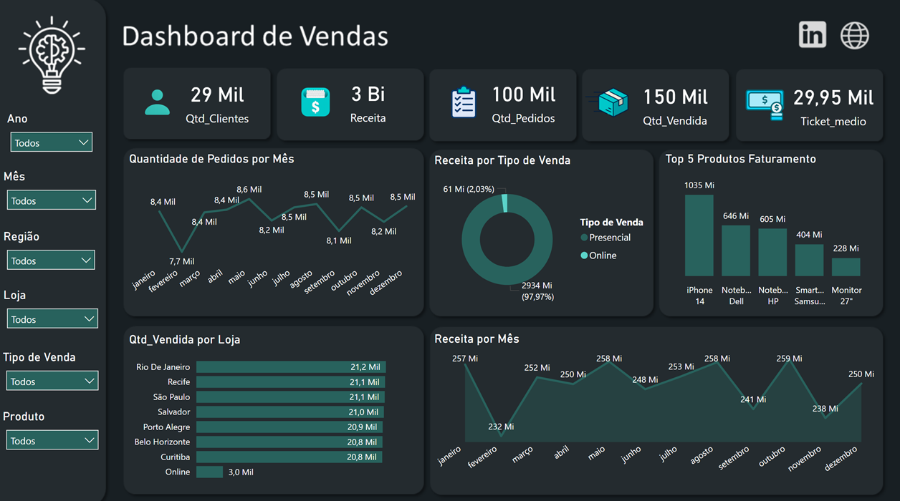

# Dashboard de Vendas

Dashboard desenvolvido para análise do desempenho comercial, com foco em faturamento, quantidade de pedidos, produtos, lojas, regiões e canais de venda.

O projeto busca transformar dados de vendas em informações que permitam identificar os principais fatores que influenciam o faturamento e apoiar decisões comerciais.

## Problema de Negócio

Uma empresa possui um grande volume de vendas distribuídas entre diferentes produtos, lojas, regiões e tipos de venda.

Apesar do alto volume de transações, a gestão possui dificuldade para responder algumas perguntas importantes:

- Qual é o faturamento total da empresa?
- Como o faturamento se comporta ao longo dos meses?
- Quais produtos geram mais receita?
- Quais lojas possuem maior volume de vendas?
- Qual é a participação das vendas presenciais e online?
- Existe relação entre quantidade de pedidos e faturamento?
- Quais períodos apresentam queda no desempenho?
- Quais produtos e regiões possuem maior impacto nos resultados?

O objetivo do dashboard é centralizar essas informações e permitir uma análise visual do desempenho comercial.

# Objetivo do Projeto

Desenvolver uma solução de Business Intelligence capaz de transformar dados de vendas em indicadores e análises que permitam compreender:

- desempenho financeiro;
- comportamento das vendas ao longo do tempo;
- desempenho por loja;
- desempenho por produto;
- participação dos canais de venda;
- evolução da quantidade de pedidos;
- principais responsáveis pelo faturamento.

#  Principais Insights

A análise do dashboard permite destacar alguns pontos:

### 1. Forte concentração no canal presencial

Aproximadamente **97,97% da receita** está concentrada nas vendas presenciais.

### 2. iPhone 14 é o principal produto em faturamento

O produto gera aproximadamente **1.035 Mi**, ficando significativamente à frente dos demais produtos do Top 5.

### 3. Faturamento relativamente estável

A receita permanece na faixa de aproximadamente **232 Mi a 259 Mi** durante os meses analisados.

### 4. Outubro apresenta o maior faturamento

Com **259 Mi**, outubro registra o maior resultado mensal observado.

### 5. Novembro apresenta queda relevante

O faturamento cai para **238 Mi**, representando um dos menores resultados do período.

#  Como o Dashboard Apoia a Tomada de Decisão

A partir das informações apresentadas, gestores podem utilizar o dashboard para:

- identificar períodos de queda ou crescimento;
- acompanhar o desempenho financeiro;
- identificar produtos estratégicos;
- avaliar o desempenho das lojas;
- acompanhar a participação dos canais de venda;
- identificar oportunidades de expansão do canal online;
- direcionar estratégias comerciais;
- apoiar decisões relacionadas a estoque e produtos;
- acompanhar indicadores de desempenho ao longo do tempo.
